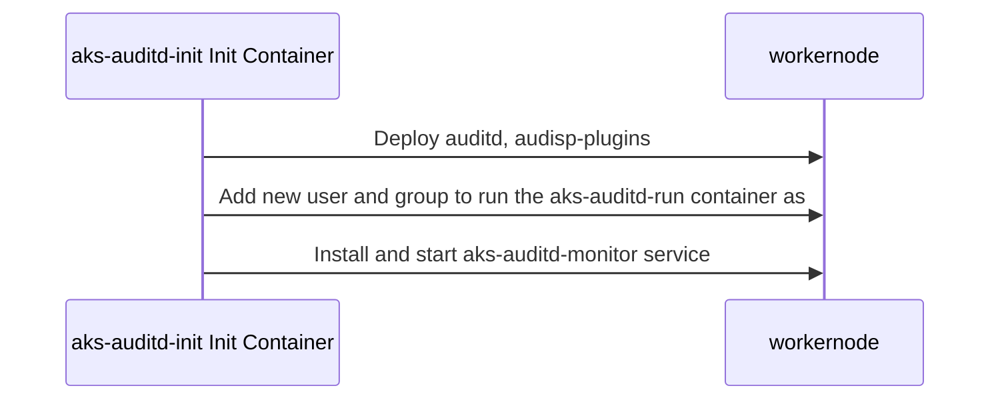
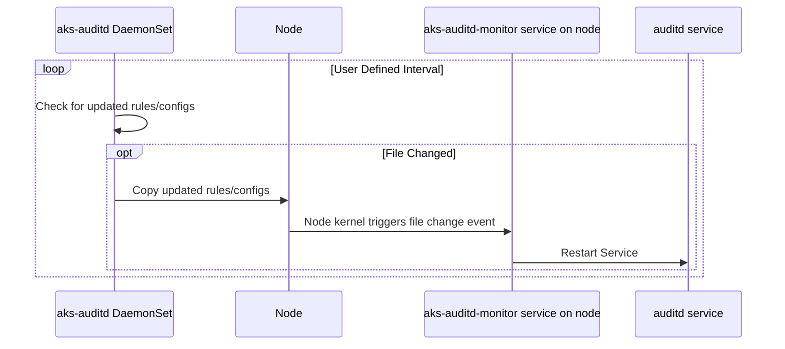
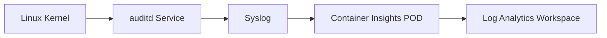

# Overview

__NOTE:__ This repository was originally forked from the [Azure aks-auditd](https://github.com/Azure/aks-auditd) implementation utilizing the OMS legacy agent. However, this implementation deviates significantly from the original and should be considered a solution unto itself. See [here](#what-changes-occurred-between-the-original-azure-implementation-and-this-one) for differences.

Linux auditd is a userspace component responsible for monitoring and logging system calls and events for security auditing purposes. It tracks file access, user activity, and changes to system configurations, providing detailed logs to help administrators monitor and review actions on the system. auditd is often used to ensure compliance with security policies and to investigate suspicious behavior or breaches. 

aks-auditd is an implementation of auditd for [Azure Kuberentes Service](https://learn.microsoft.com/en-us/azure/aks/what-is-aks) worker nodes. It runs as a Daemonset to deploy auditd and audispd-plugins to the node whenever a new node is created. The auditd service collects audit information and sends it to the node's syslog implementation. AKS relies on the the deployment of the [Container Insights add-on](https://learn.microsoft.com/en-us/azure/azure-monitor/containers/kubernetes-monitoring-enable?tabs=cli#enable-container-insights) within the cluster and a Container Insights data collection rule configured to [collect Syslog data](https://learn.microsoft.com/en-us/azure/azure-monitor/containers/container-insights-syslog). Once collected, the data arrives in the Log Analytics Workspace's Syslog table.

A deployable end-to-end demo is available in the [demo](./demo/README.md) folder. This should be the first place you look to understand how the solution works.

## Pre-built Container Image

You can pull the latest container(s) with the command below or check-out the [aks-auditd packages](https://github.com/KiPIDesTAN/aks-auditd/pkgs/container/aks-auditd) for a specific version.

```console
docker pull ghcr.io/kipidestan/aks-auditd:latest
docker pull ghcr.io/kipidestan/aks-auditd-init:latest
```

Please, note using the latest tag should only be done for testing. Updates to the aks-aduitd images are not guaranteed to work with old deployment yaml. Securing a container that runs with elevated privileges is a moving target. Thus, you should use the version tag of a specific container when deploying to production.

If you need to review changes for a specific container, look at the git tag associated with the container version.

### Image Verification

Published images are signed with [cosign](https://github.com/sigstore/cosign) keyless signing and a Software Bill of Materials.

#### Cosign Verification

Use the command below to verify the image signature. You will want to verify each image.

NOTE: The value of certificate identity is case-sensitive. If "KiPIDesTAN" is not written correctly, the verification will fail.

```console
cosign verify ghcr.io/kipidestan/aks-auditd:latest \
  --certificate-identity="https://github.com/KiPIDesTAN/aks-auditd/.github/workflows/scan-publish.yml@refs/heads/main" \
  --certificate-oidc-issuer="https://token.actions.githubusercontent.com" | jq
```

#### Software Bill of Materials

The Software Bill of Materials (SBOM) requires the [Docker SBOM cli plugin](https://github.com/docker/sbom-cli-plugin). Once installed, pull the image and run the command below:

```console
docker pull aks-auditd:latest
docker sbom aks-auditd:latest
```

NOTE: There are two images involved in this deployment. You will want to check both images.

## Build and Deploy

The build process utilizes a multi-stage build, pulling the Azure Linux core image, compiling the Go binary, and copying the required artifacts to the Azure Linux Distroless minimal image of the same version. View Dockerfiles in the root directory of the project to understand the implementation.

The commands below assume you have an Azure Container Registry accessible to push images to. The ACR must be accessible by your AKS cluster in order to deploy the image.

Set the appropriate variables for the build process.

```console
RG_NAME=<resource_group_name>
ACR_NAME=<acr_name>
ACR_URL=$(echo "$ACR_NAME.azurecr.io")
IMAGE_NAME_INIT=aks-auditd-init
IMAGE_NAME_RUN=aks-auditd-run
IMAGE_TAG=<image_tag>
```

Login to your ACR

```console
az login
az acr login --name $ACR_NAME --resource-group $RG_NAME
```

Build the image locally and push it to the ACR.

```console
docker buildx build -f Dockerfile.init -t $ACR_URL/$IMAGE_NAME_INIT:$IMAGE_TAG .
docker buildx build -f Dockerfile.run -t $ACR_URL/$IMAGE_NAME_RUN:$IMAGE_TAG .
```


To push the images to your ACR, run

```console
docker push $ACR_URL/$IMAGE_NAME_INIT:$IMAGE_TAG
docker push $ACR_URL/$IMAGE_NAME_RUN:$IMAGE_TAG
```

Once built, you can deploy the image. See an example of the deployment file at <project_root>/kubernetes/daemonset.yaml. 

## Configuration

The following values can be configured via environment variable or ConfigMap. The order of precedence is the following:

1. Environment variable
2. ConfigMap value
3. Default value

| Item |  Environment Variable | Config File Value | Default | Notes |
|---|---|---|---|--|
| Log Level |  AA_LOG_LEVEL | logLevel | 'info' | Valid values: panic, fatal, error, warn, info, debug, trace |
| Poll Interval | AA_POLL_INTERVAL | pollInterval | 30s | Interval to poll for rule/config file changes. Value must meet [ParseDuration](https://pkg.go.dev/time#ParseDuration) format requirements. e.g. 30s, 20m, 1h |
| Rules Directory | AA_RULES_DIR | rulesDirectory | /etc/audit/rules.d | Worker node directory where auditd rules exist. |
| Plugins Directory | AA_PLUGINS_DIR | pluginsDirectory | /etc/audit/plugins.d | Worker directory node where auditispd-plugins exist. |

### Configuration via ConfigMap

An example of the config.yaml ConfigMap to configure the Go binary is below or [here](./config.yaml). Once you've created your own ConfigMap, you will want to apply it on the container to "/etc/aks-auditd/config.yaml" as part of your [daemonset.yaml](./kubernetes/daemonset.yaml) deployment.

## GO Code Style

The code that managing the deployment and execution is fundamentally a series of shell scripts, but written in [Go](https://go.dev/). The Go code is written in a style close to a shell script with the intent of making it readable. It is more important to me that an end-user understands what the code does, regardless of their Go expertise, than writing heavily abstracted code.

## Sequence Diagrams

The implementation of the solution is a multi container process to reduce the attack surface. I've done my best to outline the flow.

### Initialization Container

This container runs at start-up and exits when 



### Run Container

This container runs on a continuous basis as the user and group created by the aks-auditd-init container.



Below is a flow chart for the flow of kernel audit data to a Log Analytics Workspace.



## FAQ

### How do rules and configurations on the worker node get updated?

At the set poll interval, the Go binary calculates a sha256 hash against the files in /auditd-rules and /audisp-plugins container volumes. These files are created and updates as ConfigMaps. We then calculate the sha256 hash of the files in the target directory. If there are any differences - new files, deleted files, or checksum mismatches - the _target directories are emptied_ and the files mounted in the container volume are copied over.

### Where do I find the audit data in the Log Analytics Workspace?

By default, the auditd data is sent to the LAW's Syslog table as part of the audisp-syslog process. The default facility is user.

The following LAW query will show this information when the data is sent to the user facility. Change the facility value if you've modified your [audisp-plugins.yaml](./kubernetes/configmap/audisp-plugins.yaml) to use a different facility.

```kusto
Syslog
| where Facility == 'user' and ProcessName == 'audisp-syslog'
```

### How do I change the syslog facility the data goes go?

Open the [audisp-plugins.yaml](./kubernetes/configmap/audisp-plugins.yaml) file and modify the config map portion that represents syslog.conf. The comments at the top of the syslog.conf section describe how to modify the target facility.

### How do I debug my deployment?

Coming soon...


### What changes occurred between the original Azure implementation and this one?

This code was originally forked from [Azure aks-auditd](https://github.com/Azure/aks-auditd), thinking that a change to the new agent would be straight-forward. However, this turned out not to be the case as modern improvements in container security and changes to the Azure Monitoring landscape dictated a larger change. 

Below are key differences between [Azure aks-auditd](https://github.com/Azure/aks-auditd) and this one.

| Category | Azure aks-auditd | This Repo | Reason |
|---|---|---|---|
| Base Image | [Alpine Linux](https://hub.docker.com/_/alpine) | [Azure Distroless Minimal](https://mcr.microsoft.com/en-us/product/azurelinux/distroless/minimal/about) | Azure distroless is a hardended, official Azure distro for containers. |
| Implementation | Shell Scripts | Go binary | Go static linking allows for a smaller attack surface. |
| Configurability | Minimal | [See Configuration](config.yaml) | Azure aks-auditd commands did not work with latest 
| Agent Reliance | Legacy OMS on VMSS | Container Insights deployed as POD | CI is the updated method to deliver log data to a Log Analytics Workspace. Agent runs as a Daemonset. Not on the VMSS. |

Another note is that this aks-auditd binary supports a two stage execution process. Review the [daemonset.yaml](./kubernetes/daemonset.yaml). The binary supports --mode init, which runs as an initial container, deploying the auditd service, and --mode poll, which runs as the normal process to restart the auditd service when updates from the ConfigMap configurations are applied.

What happens is that the init mode can run at elevated privileges to deploy software, add a user, give that user sudo rights to restart the auditd service, and the poll mode can restart the service as needed without the need to run as root.
